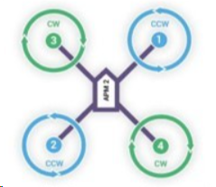

# 桨叶

桨叶是设备飞行时提供升力的关键组件，其性能直接影响飞行效率和稳定性。

> TODO 图

### 类型

- **材质**: 塑料桨、碳纤维桨。
- **尺寸**: 根据电机和设备需求选择适合的直径和螺距。

### 安装与调试

- 确保桨叶与电机安装方向正确。
- 检查桨叶是否平衡，避免震动。
- 安装后进行试运行，确保运行平稳。

### 使用注意事项

- 避免桨叶与硬物碰撞。
- 定期检查是否有裂纹或磨损。
- 四个桨叶旋转方向如图所示

