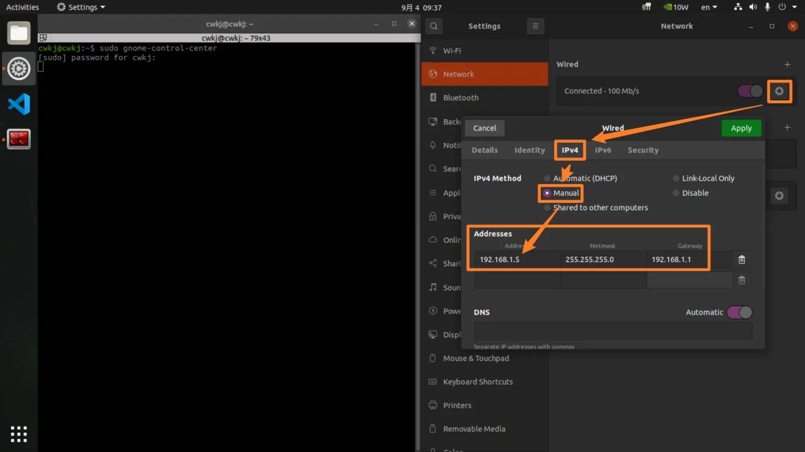
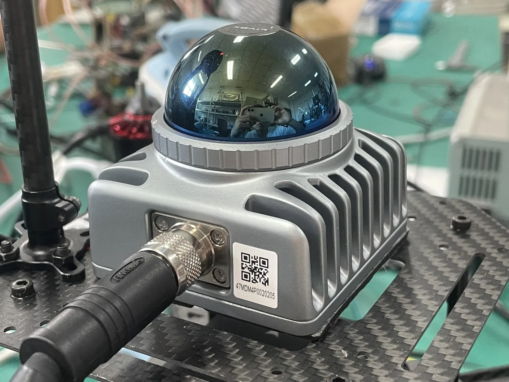
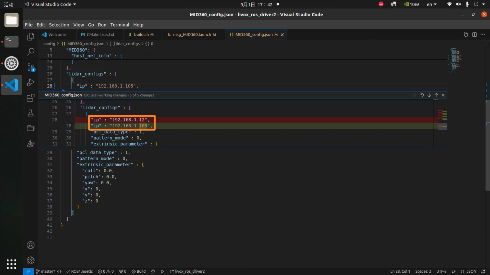
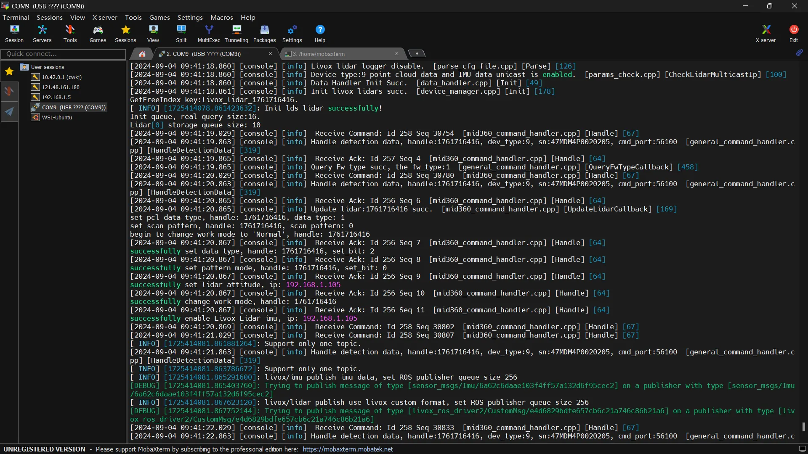

# 激光雷达 Mid360

::: tip

已购买无人机的用户此步可以跳过，无人机搭载的环境已全部配置妥当

:::

## 官方网站

https://www.livoxtech.com/mid-360

## 用户手册

<iframe src="/Livox_Mid-360_User_Manual_CHS.pdf" width="100%" height="600px"></iframe>

## 电脑IP设置

```sh
sudo gnome-control-center
```

将以太网 IPv4 地址设置如下图所示：



::: tip

至于为什么是192.168.1.5，请看这篇帖子：

https://github.com/Livox-SDK/livox_ros_driver2/issues/64

:::

## 参数配置

首先查看 MID-360 底座上的广播码：



我这台的广播码是`47MDM4P0020205`，记住这个编码。

找到`livox_ros_driver2`这个ROS包

```sh
roscd livox_ros_driver2
```

用`VSCode`打开这个包

```sh
code .
```

### bd_list

打开`launch_ROS1/msg_MID360.launch`，将默认的 `bd_list`修改为我们的广播码。


### host_net_info

打开`config/MID360_config.json`，将这些 IP 设置为以太网接口的 IP，也就是`192.168.1.5`


### lidar_configs

设置为 `192.168.1.1**`，最后两位是广播码（`47MDM4P0020205`）的最后两位（`05`）。对于我来说就是`192.168.1.105`。



## 启动驱动

```sh
roslaunch livox_ros_driver2 rviz_MID360.launch
```



### 点云数据

在`RViz`中可以看到点云数据


### 查看话题

```sh
rostopic list
```


> TODO LiDAR_IMU_Initgit
