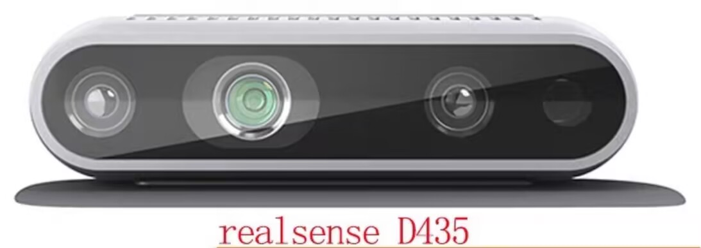

# 深度相机 D435

## 简述

Intel RealSense D435 是一款高性能 RGB-D 深度相机，采用 **主动立体视觉（Active Stereo）** 技术，主要用于 3D 视觉感知任务，如 **SLAM（同步定位与建图）、目标识别、避障** 等。其小巧轻便的设计，使其广泛应用于 **机器人、无人机、工业自动化、增强现实（AR）等领域**。

## 主要技术特点

### 传感器布局

D435 的正面共有 **四个传感器**，从左至右依次是：

- **左红外相机**
- **红外点阵投影仪**
- **右红外相机**
- **RGB 相机**

### 深度测量原理

D435 采用 **结构光+双目立体视觉** 计算深度信息：

- **双目立体视觉**：通过左、右红外相机获取视差（parallax），计算深度图。
- **红外点阵投影仪**：用于增强纹理较少场景（如白墙、玻璃等）的深度计算精度，提高鲁棒性。

### D435 vs. D435i

D435i 是 D435 的升级版本，新增了一个 **IMU 传感器**，可以提供 6 轴（加速度计 + 陀螺仪）数据，有助于提高 **VINS（视觉惯性导航系统）** 的稳定性。但需要注意的是，D435i 的 IMU 数据精度不如 **PX4 飞控中的 IMU**，在 SLAM 和导航应用中，通常还是推荐使用更高精度的惯性测量单元。

## 关键规格参数

| 参数           | 数值                       |
| -------------- | -------------------------- |
| **深度分辨率** | 最高 1280×720 @ 90 FPS     |
| **RGB 分辨率** | 最高 1920×1080             |
| **探测范围**   | 0.2 m ~ 10 m               |
| **视场角**     | 85.2° × 58°（水平 × 垂直） |
| **双目基线**   | 50 mm                      |
| **接口**       | USB 3.0 Type-C             |
| **尺寸**       | 90 mm × 25 mm × 25 mm      |
| **重量**       | 72 g                       |

## 典型应用场景

1. **机器人 SLAM**：结合 VINS、ORB-SLAM2 等算法，实现高精度建图与自主导航。
2. **无人机避障**：通过实时深度信息检测障碍物，提高飞行安全性。
3. **智能交互**：用于增强现实（AR）/ 虚拟现实（VR）设备的空间感知。
4. **工业自动化**：在物流、智能仓储等场景下，实现自动分拣、目标检测等功能。
