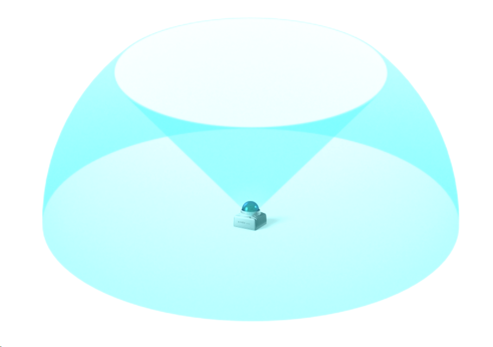

# 激光雷达 Mid360

## 官方网站

https://www.livoxtech.com/cn/mid-360

## 用户手册

<iframe src="/Livox_Mid-360_User_Manual_CHS.pdf" width="100%" height="600px"></iframe>

## 技术参数

- **激光波长**：905 nm
- **人眼安全等级**：Class 1 (IEC60825-1:2014)
- **量程**：40 m（10% 反射率），70 m（80% 反射率）
- **最小盲区**：0.1 m
- **FOV**：水平 360°，竖直 -7°~52°
- **点云输出频率**：200,000 点/秒
- **点云帧率**：10 Hz（典型值）
- **IMU**：内置 IMU 型号：ICM40609
- **工作温度范围**：-20℃ 至 55℃
- **防护等级**：IP67
- **尺寸**：65×65×60 mm
- **重量**：265 g
- **功率消耗**：6.5 W

## 360度全向点云

不同于传统机械式激光雷达，Mid-360 采用 Livox 自研混合固态技术，首次将水平视场角提升至 360° 的同时，垂直视场角也高达 59°。Mid-360 凭借更大的视场角，可帮助移动机器人感知更复杂的 3D 环境，为规划、决策提供更加全面的点云数据。

利用高精度点云，可以实现无人机的精准定位与导航避障。
