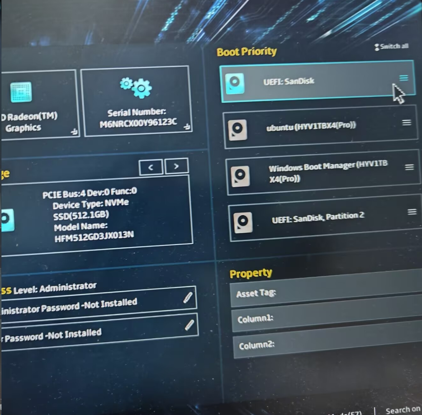
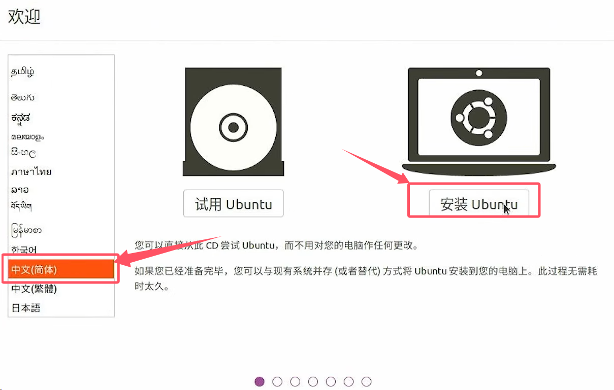

# ubuntu系统安装

::: tip

已购买无人机的用户此步可以跳过，无人机搭载的环境已全部配置妥当

:::

## 环境介绍

Ubuntu 20.04 镜像

balenaEtcher 镜像烧录软件

空闲u盘一个

## Ubuntu 20.04 镜像下载

二选一

1.[官网下载](https://releases.ubuntu.com/focal/ubuntu-20.04.6-desktop-amd64.iso) 

2.[清华源下载](https://mirrors.tuna.tsinghua.edu.cn/ubuntu-releases/20.04/ubuntu-20.04.6-desktop-amd64.iso) 

## balenaEtcher 下载

在 [balenaEtcher 官网](https://etcher.balena.io/ )下载并安装软件

## 准备好 u 盘进行烧录

::: danger

注意！！！你的 u 盘数据将会被全部清除，注意备份

:::

1. 选择下载好的镜像文件

2. 选择准备好的 u 盘

3. 现在烧录！

## 分配存储空间

如果要安装ubuntu单系统，则不需要进行分配，可以提前格式化一下更方便

如果要安装windows-ubuntu双系统，需要在磁盘管理中选择压缩卷，获得一个空闲的分区

## 选择u盘启动

关机后插入u盘，按下开机键后疯狂按f1/f2/f12/delete等按键可进入bios系统或者启动项选择，调整选择u盘启动即可

这里以华硕天选笔记本为例，按下开机键后疯狂按f2，拖拽u盘（我这里是SanDisk闪迪）到第一位，按f10保存并退出，重新开机即可进入启动盘

## 安装Ubuntu

> 这里使用了这个[视频教程](https://www.bilibili.com/video/BV1554y1n7zv)的图片

选择中文后点击安装

键盘布局选择继续

先不联网，直接继续

这里直接继续

选择其他选项

选择空闲，点击加号

若是单系统需要创建efi分区，大小填写500mb

双系统可不用创建

再次选中空闲，点击加号，把所有空间分给/即可

接下来一路继续即可

出现`Please remove the installation medium, then press ENTER:`

拔掉u盘按下回车即可
