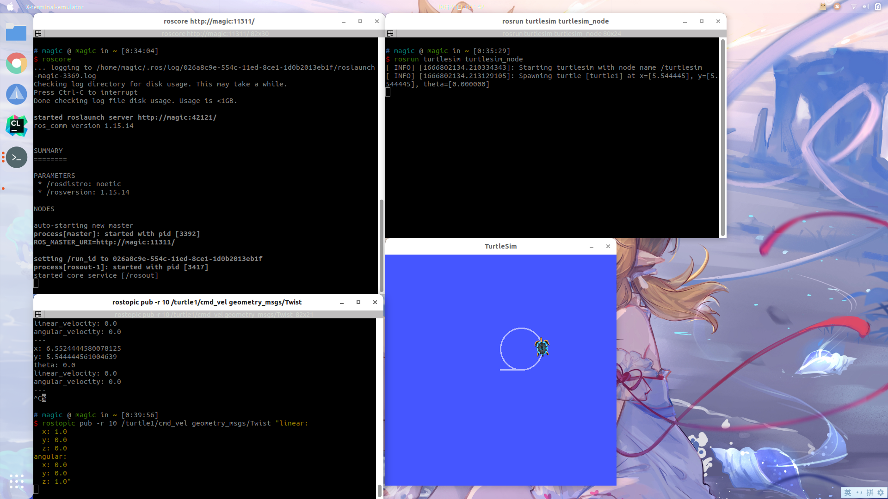
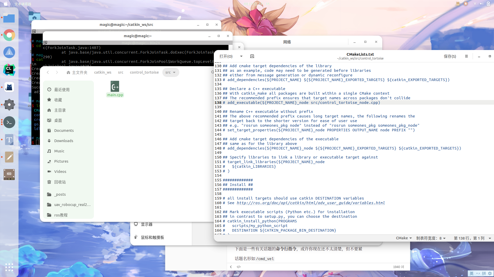
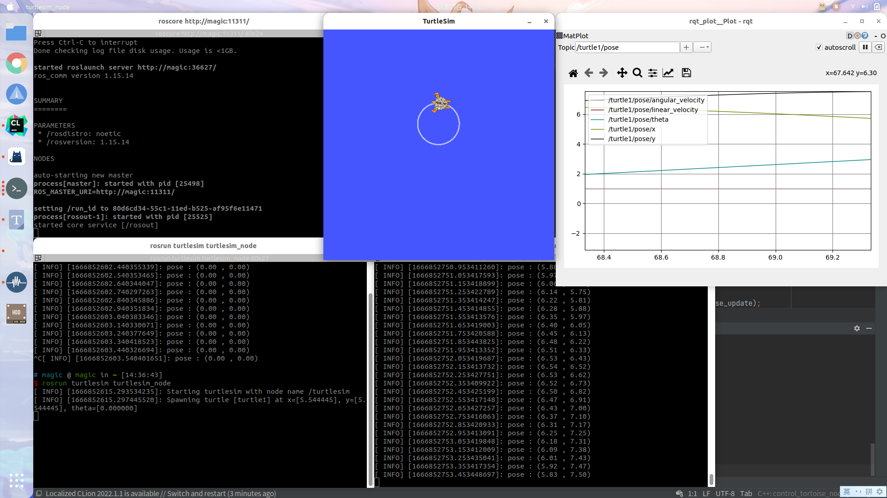

# ROS安装

::: tip

已购买无人机的用户此步可以跳过，无人机搭载的环境已全部配置妥当

:::

## 环境介绍

Ubuntu 20.04

ROS Noetic

## ROS 安装

#### 使用[鱼香肉丝](https://fishros.org.cn/forum/topic/20/%E5%B0%8F%E9%B1%BC%E7%9A%84%E4%B8%80%E9%94%AE%E5%AE%89%E8%A3%85%E7%B3%BB%E5%88%97)进行安装（推荐）

一行代码-解决人生烦恼

```
wget http://fishros.com/install -O fishros && . fishros
```

输入1，安装ros

输入1，更换系统源

输入1，仅更换系统源

输入3，安装ROS Noetic

> （不一定是3，注意选项ROS Noetic即可）

输入1，安装桌面版

ROS包含构建包的依赖，也就是下面这个安装命令，否则后面安装PX4环境会出现问题。

```
sudo apt install python3-rosdep python3-rosinstall python3-rosinstall-generator python3-wstool build-essential
```

#### 根据[ros官网](https://wiki.ros.org/cn/noetic/Installation/Ubuntu)指令进行安装

::: details 点击展开

设置清华ros软件源

```
sudo sh -c '. /etc/lsb-release && echo "deb http://mirrors.tuna.tsinghua.edu.cn/ros/ubuntu/ `lsb_release -cs` main" > /etc/apt/sources.list.d/ros-latest.list'
```

> 若要官方源则指令如下
>
> ```
> sudo sh -c 'echo "deb http://packages.ros.org/ros/ubuntu $(lsb_release -sc) main" > /etc/apt/sources.list.d/ros-latest.list'
> ```

先安装curl

```
sudo apt install curl
```

设置密钥

```
curl -s https://raw.githubusercontent.com/ros/rosdistro/master/ros.asc | sudo apt-key add -
```

更新软件源

```
sudo apt update
```

安装 ros 完整版

```
sudo apt install ros-noetic-desktop-full
```

设置环境变量

```
echo "source /opt/ros/noetic/setup.bash" >> ~/.bashrc
source ~/.bashrc
```

构建包的依赖关系前先安装依赖

```
sudo apt install python3-rosdep python3-rosinstall python3-rosinstall-generator python3-wstool build-essential
```

初始化 rosdep

```
sudo rosdep init
rosdep update
```

:::

## 基础学习

## 什么是ros

全称是Robot Operating System，中文为**机器人操作系统**

我认为最主要的是理解**话题（topic）**这个概念，由此又一个概念叫**节点**

一个**话题**可以被订阅，也可以往里发布内容，做这些事的叫**节点**，这也是我们所说的**订阅者**和**发布者**

**就像这里有一个正方形的门，它就是一个话题，一边有一人P在往里输入正方形的物体，它就是发布者，也是一个节点，另一边有一人S在收这个正方形的物体，他就是订阅者，也是一个节点。这个正方形就是某种指定的数据类型**

下面是一些有关话题的**命令行指令**，或许你现在还不太清楚，但不要紧

话题名形如`/cmd_vel`

```zsh
# 查看当前的所有话题
rostopic list
# 查看某个话题的订阅者、发布者、发布内容的数据类型
rostopic info 话题名
# 查看该话题发布的具体内容
# -n 可以指定发布次数
rostopic echo 话题名
# 查看一个话题的发布频率
rostopic hz 话题名
# 查看某个数据类型的具体内容
rosmsg show 数据类型名称
# 向某个话题里发布内容 可以使用tab自动补全
# -n 可以指定发布次数 -r 可以指定发布频率
rostopic pub 话题名 数据类型 数据内容
# 可以把某个话题保存到.bag文件
rosbag record 话题名
# 可以把.bag文件保存的内容发布出去
# -s 可以指定开始秒数 -r 可以指定发布速度
rosbag play .bag文件
#动态调参
rosrun rqt_reconfigure rqt_reconfigure
#图形化发布服务
rosrun rqt_service_caller rqt_service_caller
#图形化查看话题
rosrun rqt_topic rqt_topic
```

### 在命令行中进行话题通信

先使用小乌龟（经典）操作一下吧

```zsh
# 打开一个终端（ctrl+alt+T）输入 回车
roscore
```

```zsh
# 再打开一个终端输入 回车 就可以看到小乌龟啦
rosrun turtlesim turtlesim_node
```

再打开一个终端备用，现在的情况大概如下图


接下来我们先熟悉一下一些基本**命令行指令**

```zsh
# 查看当前的所有话题
rostopic list
```

>$ **rostopic list**                             
>/rosout
>/rosout_agg
>/turtle1/cmd_vel
>/turtle1/color_sensor
>/turtle1/pose

这里有五个话题在发布（或者订阅）着某种数据类型

```zsh
# 我们先来查看一下/turtle1/pose的情况
rostopic info /turtle1/pose
```

> $ rostopic info /turtle1/pose
>
> Type: turtlesim/Pose
>
> Publishers: 
>
> \* /turtlesim (http://magic:36353/)
>
> Subscribers: None

这里的意思是`/turtle1/pose`这个话题在被`/turtlesim`节点发布（Publisher）没有被人订阅，内容物是一个叫`turtlesim/Pose`的数据类型

```zsh
# 查看这个数据类型的具体内容物
rosmsg show turtlesim/Pose
```

可以看到有五个float类型的变量，他们的含义和就是变量名的英文啦，例如xy是小乌龟的坐标，theta是角度

那数据内容到底是什么呢，用下面指令可以查看

```zsh
# 查看话题具体内容物
rostopic echo /turtle1/pose
```

可以看到数据一直在刷新，这样我们就在命令行实现了话题的订阅（Subscriber）

>  按下`Ctrl+c`可以终止这个程序

让我们回到话题列表，你会发现有一个`/turtle1/cmd_vel`的话题，他就是控制小乌龟**移动**的话题，仿照上面的`rostopic info`操作，可以发现`/turtlesim`节点一直在订阅（Subscriber），而没有人发布（Publisher），那我们来发布就好了

```zsh
# 不建议直接复制 自己打一点然后使用<tab>按键自动补全就好
rostopic pub /turtle1/cmd_vel geometry_msgs/Twist "linear:
  x: 1.0
  y: 0.0
  z: 0.0
angular:
  x: 0.0
  y: 0.0
  z: 0.0" 
```

设置线速度是1.0，发现小乌龟往前走了一点距离，如果想控制小乌龟一直移动，可以用-r 参数指定频率

（即1s内发送消息的次数）然后设置一下角速度，就可以走圆了

```zsh
# 可以一直走一个圆
rostopic pub -r 10 /turtle1/cmd_vel geometry_msgs/Twist "linear:
  x: 1.0 
  y: 0.0
  z: 0.0
angular:
  x: 0.0
  y: 0.0
  z: 1.0"
```

现在应大致如下图



现在你应该明白了，我们可以通过**话题通信**的方式订阅（Subscriber）到小乌龟的位置信息`/turtle1/pose`、向速度话题`/turtle1/cmd_vel`里发布（Publisher）速度控制小乌龟移动

接下来我将以**c++**为例演示如何在**代码**中实现这部分操作

* 下面是几个可能用到工具

```zsh
# 图形化查看节点和话题 圆圈住的是节点名，曲线上的是话题名
rosrun rqt_graph rqt_graph
# 图形化查看某个话题里面的数据
rosrun rqt_plot rqt_plot
# 如果一个话题里是画面，可以用这个查看
rosrun rqt_image rqt_image
```

### 用c++实现话题通信

#### 准备工作

* 1.创建工作空间

  ```zsh
  # 新建文件夹catkin_ws/src 这样的话工作空间就叫catkin_ws
  mkdir -p ~/catkin_ws/src
  # 进入catkin_ws/src文件夹
  cd ~/catkin_ws/src
  # 初始化工作空间 会在当前目录生成一个CmakeLists.txt文件
  catkin_init_workspace
  ```

* 2.编译工作空间

  ```zsh
  # 编译时要进入工作空间根目录
  cd ~/catkin_ws/
  # 编译 每次有新功能包或者修改代码之后都要编译
  catkin_make
  ```

* 3.设置环境变量

  ```zsh
  # 这样是让当前终端生效
  source ~/catkin_ws/devel/setup.bash
  ```

  如果不想每次打开一个新终端都source一下的话，在用户根目录下找到`.bashrc`文件，把`source ~/catkin_ws/devel/setup.bash`写入到最后一行然后保存

  > 以`.`开头的文件是默认隐藏的，按下`ctrl+h`可以显示隐藏的文件

* 4.创建功能包

  ```zsh
  # 进入指定位置
  cd ~/catkin_ws/src
  # 创建功能包 这句指令应该在src目录下运行
  catkin_create_pkg control_tortoise roscpp rospy std_msgs geometry_msgs turtlesim
  ```

  `control_tortoise`是功能包的名字，后面都是一些依赖

当前**文件夹结构**应该如下

```zsh
catkin_ws --- 工作空间名字，其他名字也是可以的

    |--- build:编译空间，catkin_make时候会生成

    |--- devel:开发空间，catkin_make时候会生成

    |--- src: 源码

        |-- package1：功能包1(ROS基本单元)，只能由字母、数字与下划线组成

            |-- CMakeLists.txt 配置编译规则 需要进行一定的修改

            |-- package.xml 包信息

            |-- scripts 存储python文件

            |-- src 存储C++源文件

            |-- include 头文件

            |-- launch 可一次性运行多个节点 

        |-- package2：功能包2

        |-- package3：功能包3

        |-- CMakeLists.txt: 编译的基本配置 初始化工作空间时生成
```

#### 源码书写

如上文件结构所示，cpp文件放在src中，先生成一个main.cpp（运行`touch main.cpp`即可生成）

建议自己打一打喔~ 最好能理解

```cpp
//ros语法基本头文件
#include<ros/ros.h>
//小乌龟速度的数据类型是geometry_msgs::Twist所以引入以下头文件（geometry_msgs在cmake中find_package里已经填写过了
#include<geometry_msgs/Twist.h>
//小乌龟位置的数据类型是turtlesim::Pose所以引入以下头文件（turtlesim在cmake中find_package里已经填写过了
#include<turtlesim/Pose.h>

//申明全局变量速度和位置 和int a之类的其实差不多
geometry_msgs::Twist vel;

turtlesim::Pose pose;

//这里是回调函数callback 每次运行ros::spinOnce()就会调用回调函数
void pose_update_cb(const turtlesim::Pose::ConstPtr &msg)
{
	//回调函数读出小乌龟位置信息然后存入pose变量中
	pose = (*msg);
}

//主程序
int main(int argc, char **argv)
{
	//初始化ROS,它允许ROS通过命令行进行名称重映射
	ros::init(argc, argv, "control_tortoise");
	//为这个进程的节点创建一个句柄
	ros::NodeHandle n;
	//创建一个订阅者，名叫pose_sub，因为是订阅者所以是subscribe，数据类型是turtlesim::Pose
	//括号里面第一个参数是话题名，第二个是队列长度，不明白的话就用1，第三个是回调函数，会读取队列里面的数据
	ros::Subscriber pose_sub = n.subscribe<turtlesim::Pose>("/turtle1/pose", 1, pose_update_cb);
	//创建一个发布者，名叫vel_pub，因为是发布者所以是advertise，数据类型是geometry_msgs::Twist
	//括号里面第一个参数是话题名，第二个是队列长度，不明白的话就用1，因为是发布者所以没有回调函数
	ros::Publisher vel_pub = n.advertise<geometry_msgs::Twist>("/turtle1/cmd_vel", 1);
	//指定循环频率是10，r为变量名
	ros::Rate r(10);

	//进入循环 当我们按下ctrl+c终止程序时循环结束
	while (ros::ok()) {
		//打印pose的信息
		ROS_INFO("pose : (%.2lf , %.2lf)", pose.x, pose.y);
		//设定速度
		vel.linear.x = 1.0;
		vel.angular.z = 1.0;
		//发布速度
		vel_pub.publish(vel);
		//调用回调函数
		ros::spinOnce();
		//睡一下 以达到我们设定的频率
		r.sleep();
	}
}
```

#### 编译工作空间

* 编译之前首先要去**功能包**下的CMakeLists.txt修改一些东西



看到138行152、153、153 （或许在这几行附近）把注释去掉

改为如下样子

```cmake
# 括号里第一个参数是节点的名字
# 第二个参数是cpp文件的路径，从功能包根目录开始 可以写多个cpp
add_executable(control_tortoise_node src/main.cpp)

# 此处节点名保持和上述一直
target_link_libraries(control_tortoise_node
   ${catkin_LIBRARIES}
)
```

* 编译

```zsh
# 编译时要进入工作空间根目录
cd ~/catkin_ws
# 编译
catkin_make
```

> 没有红色报错的话就算是成功啦

#### 运行

还是和之前一样把小乌龟启动起来

```zsh
# 终端1
roscore
# 终端2
rosrun turtlesim turtlesim_node
```

现在已经准备就绪，接下来的就是把我们的程序运行起来

```zsh
# rosrun命令可以启动某个节点 第一个参数书是功能包的名字 第二个参数是节点名字
# 功能包的名字是在我们生成功能包时命名的 节点的名字则是在cmakelist中填写的 还记得吗
rosrun control_tortoise control_tortoise_node
```

如果不出意外的小乌龟就可以正常转圈，控制台输出位置信息了

还可以使用`rosrun rqt_plot rqt_plot`图形化查看数据内容



现在的你是否可以自己订阅一个话题或者往一个话题里面发布消息呢

#### launch文件

有些时候使用的是roslaunch而并非rosrun，roslaunch的好处在于可以一次性**开很多个节点**

在功能包下新建launch文件，并生成一个`control_tortoise.launch`

填入如下内容

```xml
<launch>
  <node pkg="control_tortoise" type="control_tortoise_node" name="control_tortoise_name" output="screen"/>
</launch>
```

pkg代表功能包的名字   type是节点名   name可以随意取名   `output="screen"`意味着结果会输出在控制台

这时候可以输入`roslaunch control_tortoise control_tortoise.launch`来代替`rosrun control_tortoise control_tortoise_node`

> 此外，当使用launch文件时，可以进行配置文件的读入、话题的重映射、命名空间的书写等等操作
>
> 下面是一个launch实例，**没有实际意义**，只是向你表述launch的各种使用方法，比如arg、remap、node、include、rosparam、group等
>
> ```xml
> <?xml version="1.0"?>
> <launch>
>  <arg name="map_frame" default="map"/>
>  <remap from="/odom" to="/base_link"/>
>  <include file="$(find mavros)/launch/px4.launch">
>      <arg name="fcu_url" value="/dev/ttyUSB0:57600"/>
>  </include>
> 	<node pkg="camera" type="transform_cam_to_10hz" name="transform_cam_to_10hz" output="screen"/>
>  <node type="rviz" name="rviz" pkg="rviz" args="-d $(find uav_robotcup)/rviz/local.rviz" />
>  <node pkg="cat" type="cat" name="cat" output="screen"/>
> 		<rosparam file="$(find uav_robotcup)/params/settings.yaml" command="load"/>
>  <group ns="door">
>  	<node pkg="move_base" type="move_base" respawn="false" name="move_base" output="screen" clear_params="true">
>  		<param name="controller_frequency" value="10.0"/> 
>  		<rosparam file="$(find nav_2d_door)/params/costmap_common_params.yaml" command="load" ns="global_costmap"/>
>  		<remap from="/laser/scan" to="$(arg laser_topic)"/>
> 		</node>
>  </group>
>  <node pkg="tf" type="static_transform_publisher" name="tf_world_to_map_broadcaster" required="true"
>        args="0 0 0 0 0 0 world map 100"/>
> </launch>
> ```

### tf坐标转换

> 建议先行阅读[ros wiki的tf教程](http://wiki.ros.org/tf)以及[发布坐标转换](http://wiki.ros.org/tf/Tutorials/Introduction%20to%20tf) 下文主要向你表述在px4+gazebo11仿真情况下如何连接飞机的坐标系
>
> 其他动态tf连接同理，如果你没有安装px4，不需要跟着教程一步一步实现，看明白即可

飞机的定位信息在`mavros/local_position/pose`中发布，包含坐标xyz以及四元数xyzw

使用`rosrun rqt_tf_tree rqt_tf_tree`中查看tf树可以看到一个游离的map和base_link，我们的目标就是**把这两个坐标系正确的连接起来**

示例代码如下

```cpp
#include <ros/ros.h>
#include <tf/transform_broadcaster.h>
#include <geometry_msgs/PoseStamped.h>

void poseCallback(const geometry_msgs::PoseStamped& msg){
    # 申明一个静态的广播用来转发
	static tf::TransformBroadcaster br;
    # 这个变量是用来表示两个坐标系的变换关系
	tf::Transform transform;
    # 先设置xyz坐标的关系
	transform.setOrigin(tf::Vector3(msg.pose.position.x, msg.pose.position.y, msg.pose.position.z));
    # 申明一个tf的四元数
	tf::Quaternion q;
    # 从msg类型的四元数转换到tf的四元数（tf::中还有其他方法可以使用）
	tf::quaternionMsgToTF(msg.pose.orientation,q);
    # 如果是用欧拉角则使用下面的这个函数
	//q.setRPY(0, 0, msg->theta);
    # 设定四元数
	transform.setRotation(q);
    # 发布坐标转换，前者是父坐标系，后者是子坐标系
	br.sendTransform(tf::StampedTransform(transform, ros::Time::now(), "map", "base_link"));
}

int main(int argc, char** argv){
	ros::init(argc, argv, "broadcaster_map_to_base_link");
	ros::NodeHandle node;
	ros::Subscriber sub = node.subscribe("/mavros/local_position/pose", 10, &poseCallback);
	ros::spin();
	return 0;
};
```

然后可以打开一个rviz订阅两个坐标系，接着让飞机起飞，观察是否和现实相符合

> 在mavros中也提供了一个很方便的接口，在启动gazebo的launch中最后加入下面几行和上面的效果是一样的
>
> ```xml
> <param name="/mavros/local_position/tf/frame_id" type="str" value="map" />
> <param name="/mavros/local_position/tf/child_frame_id" type="str" value="base_link" />
> <param name="/mavros/local_position/tf/send" type="bool" value="true" />
> ```

### 多机通信

> 该方法可以实现在一台电脑（从机）上订阅另外一台电脑（主机）里的ros话题（需在局域网下）

* 输入`ifconfig`查看本机ip地址

* 把下面的内容写入.bashrc中，两台电脑中的`ROS_MASTER_URI`里的ip地址填**主机**的ip，`ROS_IP`就填自己的ip

  ```bash
  export ROS_MASTER_URI=http://192.168.1.113:11311
  export ROS_IP=192.168.1.108
  ```

