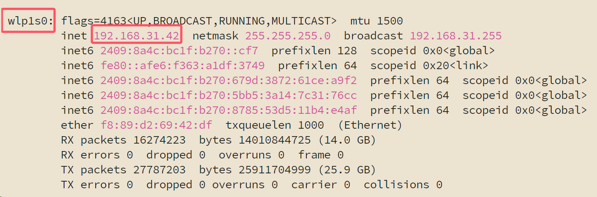
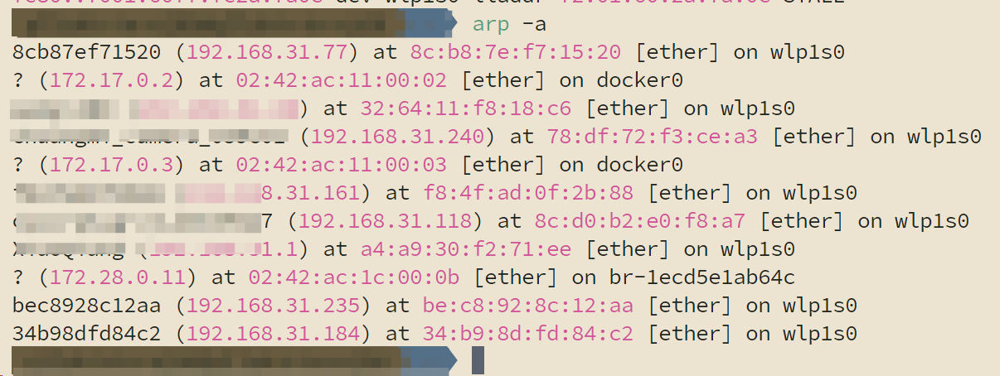

# 如何远程连接飞机

## 如何查询无人机的ip地址

::: tip

要先连接显示屏键鼠，直接操作机载电脑连上过一次你的wifi，以后才会自动连接

:::

### 可以直接连接显示屏时

```
ifconfig
```

找到类似`wlp1s0`字样的组，比如下面`192.168.31.42`就是无人机机载电脑的ip



### 可以进入路由器后台时

windows用指令`ipconfig`；ubuntu使用`ifconfig`可以查询自己所在ip网段，一般`.1`是路由器的ip，这里以小米路由器为例，一般情况下是`192.168.31.1`，输入在路由器中打开，输入管理员密码，点击终端设备即可查看设备ip


:::: tabs

::: tab Windows

打开cmd或者powershell输入`arp -a`

可以看出我们是`192.168.31.x`网段的，下面有`192.168.31.42`、`192.168.31.118`、`192.168.31.161`，1大概率是路由器ip，上面三个ip其中之一就是无人机机载电脑的ip


:::

::: tab Ubuntu

同样使用`arp -a`指令，找到`192.168.31.x`的设备，机载电脑是其中之一



:::

::::

## 使用nomachine图形化远程连接

详情请见：

https://phoenixtuav.github.io/handbook/6.%E8%BD%AF%E4%BB%B6%E5%AE%89%E8%A3%85/6-2%20%E8%BF%9C%E7%A8%8B%E8%BF%9E%E6%8E%A5/6-2-1%20NoMachine.html

## 使用MobaXterm纯命令行连接

详情请见：

https://phoenixtuav.github.io/handbook/6.%E8%BD%AF%E4%BB%B6%E5%AE%89%E8%A3%85/6-2%20%E8%BF%9C%E7%A8%8B%E8%BF%9E%E6%8E%A5/6-2-3%20MobaXterm.html
