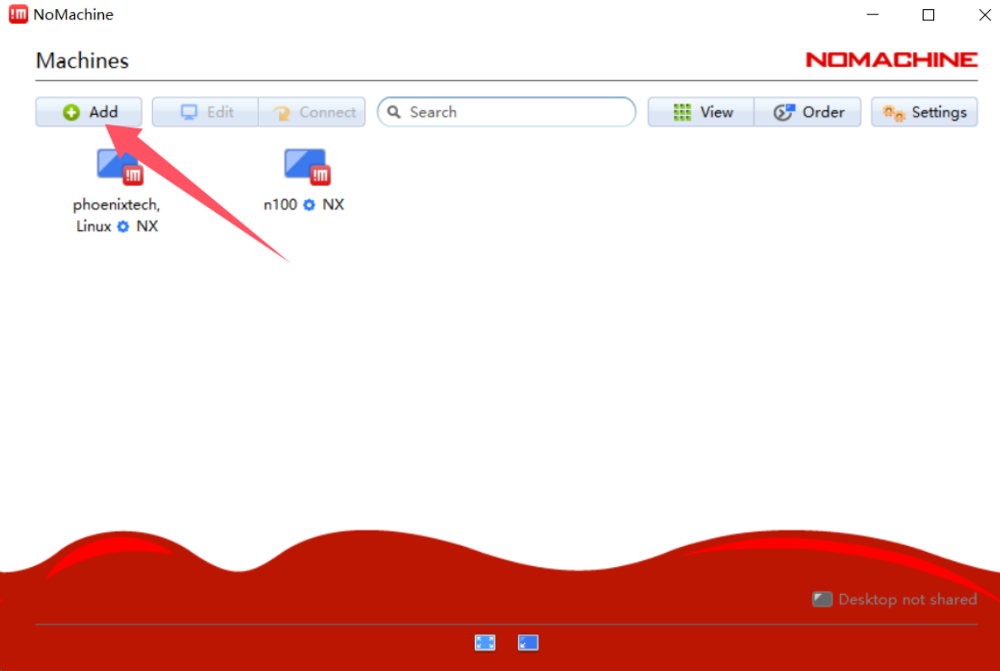

# 如何远程连接飞机

## 如何查询无人机的ip地址

::: tip

要先连接显示屏键鼠，直接操作机载电脑连上过一次你的wifi，以后才会自动连接

:::

### 可以直接连接显示屏时

```
ifconfig
```

找到类似`wlp1s0`字样的组，比如下面`192.168.31.42`就是无人机机载电脑的ip


### 可以进入路由器后台时

windows用指令`ipconfig`；ubuntu使用`ifconfig`可以查询自己所在ip网段，一般`.1`是路由器的ip，这里以小米路由器为例，一般情况下是`192.168.31.1`，输入在路由器中打开，输入管理员密码，点击终端设备即可查看设备ip


### Window查看方法

打开cmd或者powershell输入`arp -a`

可以看出我们是`192.168.31.x`网段的，下面有`192.168.31.42`、`192.168.31.118`、`192.168.31.161`，1大概率是路由器ip，上面三个ip其中之一就是无人机机载电脑的ip


### Ubuntu查看方法

同样使用`arp -a`指令，找到`192.168.31.x`的设备，机载电脑是其中之一


## 使用nomachine图形化远程连接

在[nomachine官网](https://www.nomachine.com/)下载自己系统对应的软件包进行安装

> 蓝奏云盘下载链接
>
> [windows版](https://wwcm.lanzoue.com/ivFFV2l9rjnc)  密码:eit0
>
> [ubuntu amd64 deb包](https://wwcm.lanzoue.com/iLbwC2l9rrvi) 密码:9reo
>
> [ubuntu arm64 deb包](https://wwcm.lanzoue.com/i3yMq2l9rtcb) 密码:e8tt

点击add添加

> 如果直接在这个界面出现了目标计算机，可以直接双击连接



填入名称和ip


输入账号密码一路yes就可以连接上了

## 使用MobaXterm纯命令行连接

[Github汉化版](https://github.com/RipplePiam/MobaXterm-Chinese-Simplified/releases)下载并安装

> [官方下载地址](https://mobaxterm.mobatek.net/download-home-edition.html)

创建连接，输入密码即可


