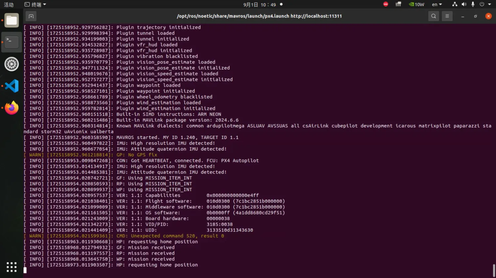
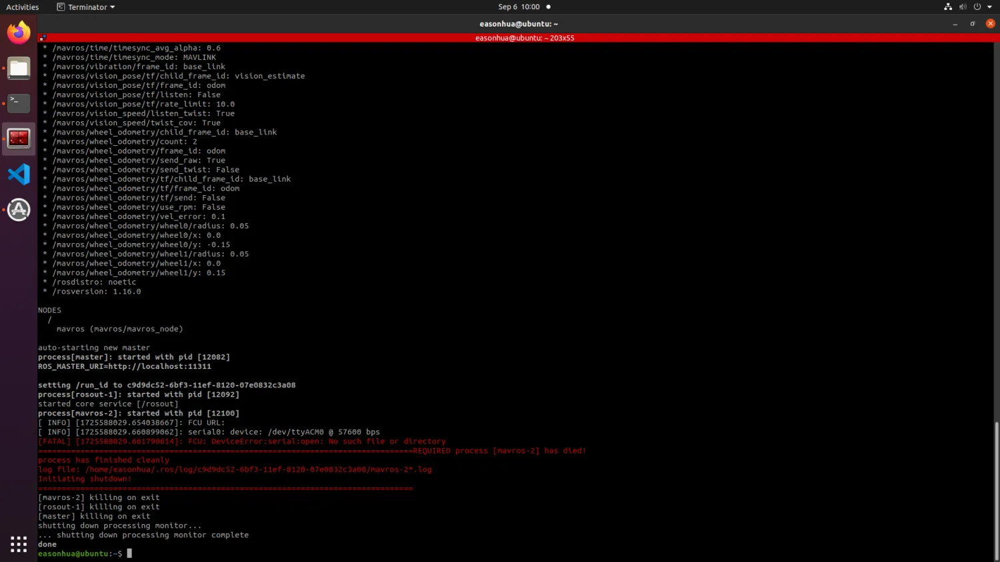

# 远程连接飞控

## 远程连接机载电脑

[远程连接机载电脑](./4-1-1%20远程连接机载电脑.md)

## 查找飞控设备

确认飞控的串口连接正常

```sh
ls /dev/tty*
```

一般是`/dev/ttyACM0`

为飞控串口赋予读写权限

```sh
sudo chmod 777 /dev/ttyACM0
```

## MAVROS参数配置

检查`MAVROS`配置文件，通常位于`/opt/ros/noetic/share/mavros/launch`文件夹下

```sh
roscd mavros/launch
```

为`px4.launch`文件赋予读写权限

```sh
sudo chmod 777 px4.launch
```

修改`px4.launch`文件：

```sh
vim px4.launch
```

有以下2个参数需要修改：

- fcu_url: 要打开的串口名按实际计算机的设备名来设置，波特率设置 57600，则设置为`serial:///dev/ttyACM0:57600`
- gcs_url: 飞控与QGC通信的端口。推荐设置为`udp-b://@`，即广播，此时局域网内任何一台电脑打开`QGC`就能连上`PX4`

修改完成后，保存文件并退出。

## 开启MAVROS

```sh
roslaunch mavros px4.launch
```

MAVROS连接上飞控之后会打印飞控的固件版本等信息。



::: tip

如果你遇到如下图所示的报错，说明`fcu_url`可能没有正确设置。



:::

新开一个终端，用以下命令检查MAVROS状态：

```sh
rostopic echo /mavros/state
```

若`connected: True`,则说明`MAVROS`与`PX4`通信成功。
