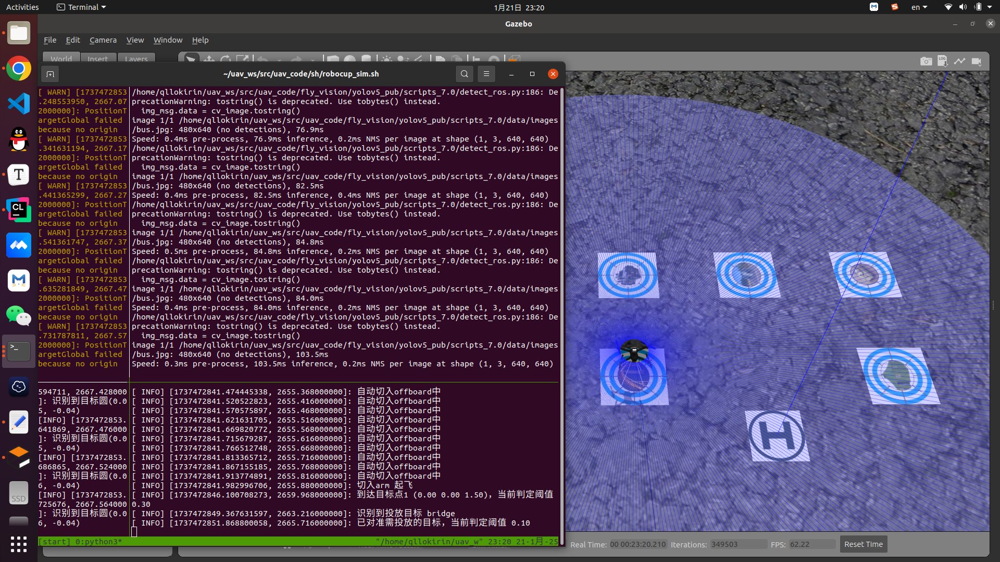

# ROBOCUP 中国机器人大赛

## 规则介绍

> TODO

以仿真示例

> **实物脚本是`~/uav_ws/src/uav_code/sh/robocup_real.sh`，需要将`~/uav_ws/src/uav_code/fly_demo/params/robocup.yaml`中的参数改为`if_true: true`**

## 快速启动脚本

运行使用tmux快捷脚本直接自动填充好指令

```
~/uav_ws/src/uav_code/sh/robocup_sim.sh
```

## 执行启动指令

### 打开仿真环境

```
roslaunch fly_sim sim.launch world_name:=robocup.world
```

### 打开视觉识别节点

```
roslaunch circle_qr_detect sim.launch
```

```
conda activate yolov5 && roslaunch yolov5_pub yolov5_detect_sim.launch
```

## 启动控制节点

打开`~/uav_ws/src/uav_code/fly_demo/params/robocup.yaml`调整参数

**需要将改为`if_true: false`**以使无人机自动起飞，为true时无人机会自动切入offboard，为false时会等待遥控器拨下offboard拨杆

```
# 实物还是仿真 仿真（false）中自动起飞 实物（true）中等待遥控器切入offboard模式
if_true: false
#-------------------------------------
#  速度参数
#-------------------------------------
if_modify_vel_param: true
max_vel_xy: 0.5
max_vel_z: 0.5
threshold_distance_navigation: 0.3
# 目标距离圆多远判定为要投放的目标
distance_to_circle: 0.4
#-------------------------------------
#  投放参数
#-------------------------------------
# 要投放的目标 （俯视） 右下为序号1 右上为序号2 左下为3 左上为4
target1: 3
target2: 4
special_circle_number: 8
unload_z: 0.0
unload_wait_ok_time: 0.8
threshold_distance_unload_alignment: 0.1
threshold_distance_unload: 0.08
#-------------------------------------
#  降落参数
#-------------------------------------
fly_to_land_z: 0.8
land_z: 0.0
threshold_distance_land_alignment: 0.1
threshold_distance_land: 0.05
#-------------------------------------
#  物块参数 前x左y
#-------------------------------------
boxes:
  - x: 0.1426
    y: 0
  - x: 0
    y: 0.1426
  - x: 0
    y: -0.1426
#-------------------------------------
#  点位参数
#-------------------------------------
points:
  # 起飞点
  - x: 0.0
    y: 0.0
    z: 1.0
  # 二维码
  - x: 1.8
    y: 0.0
    z: 1.0
  # 靶子1
  - x: 1.8
    y: -1.6
    z: 1.0
  # 靶子2
  - x: 3.6
    y: -1.6
    z: 1.0
  # 中转点
  - x: 1.8
    y: -1.6
    z: 1.0
  # 靶子3
  - x: 1.8
    y: 1.6
    z: 1.0
  # 靶子4
  - x: 3.6
    y: 1.6
    z: 1.0
  # 中转点
  - x: 6.0
    y: 1.0
    z: 1.0
  # 门前
  - x: 6.0
    y: -1.0
    z: 1.45
  # 门后
  - x: 6.0
    y: -2.35
    z: 1.45
  # 中转点
  - x: 1.6
    y: -2.3
    z: 1.0
```

### 启动控制代码

```
roslaunch fly_demo robocup.launch
```

