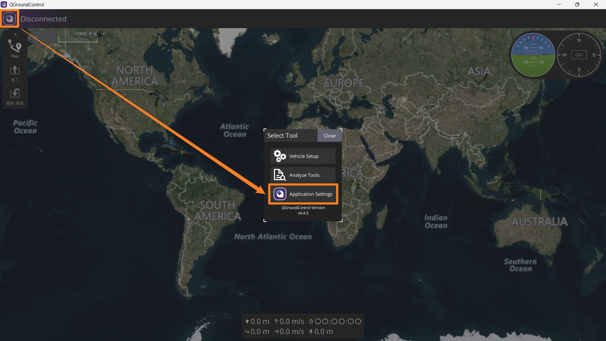
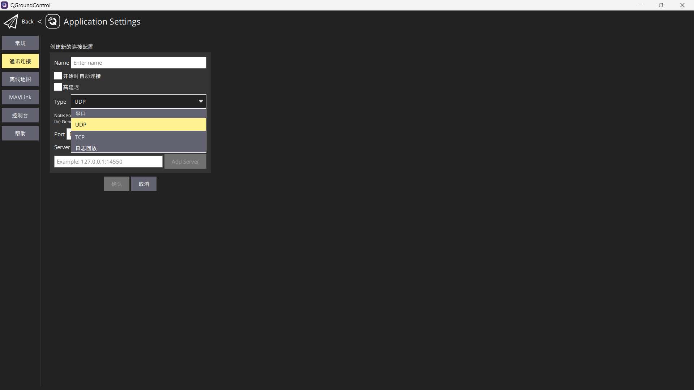
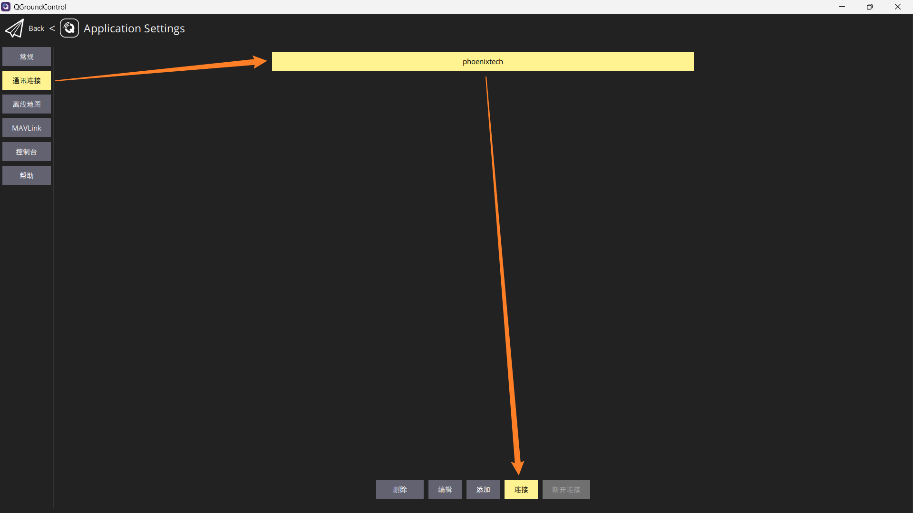
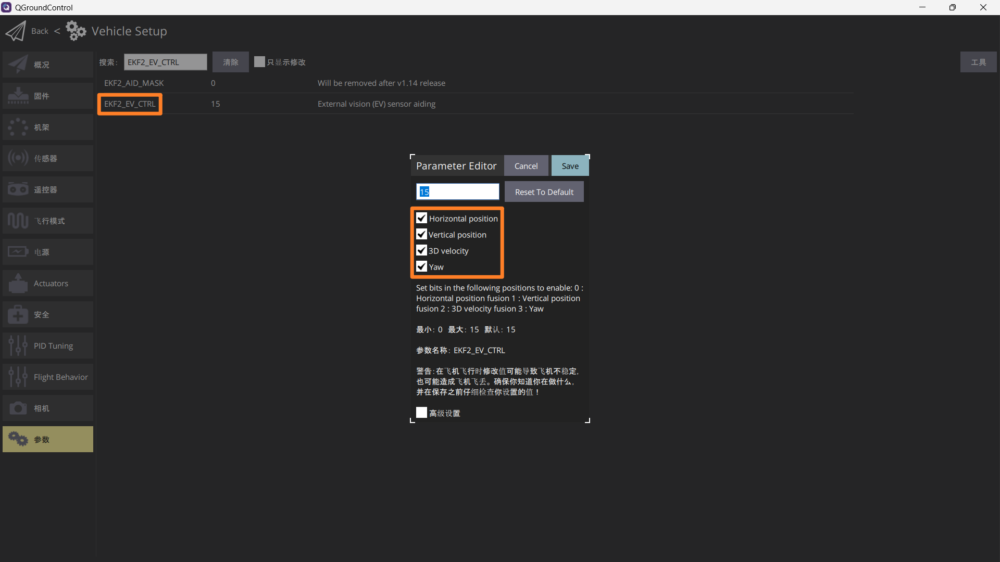
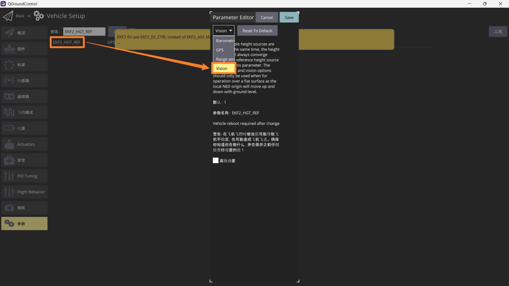
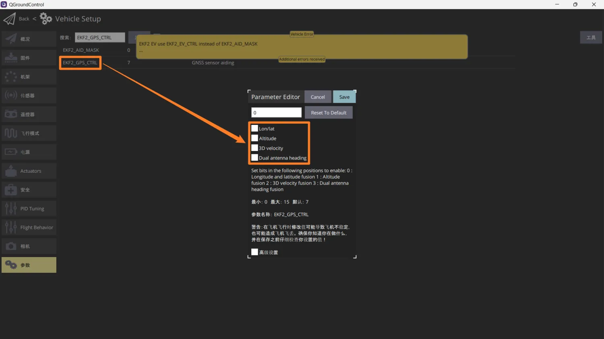
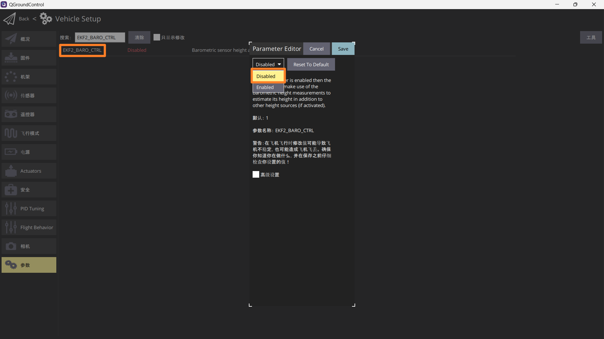
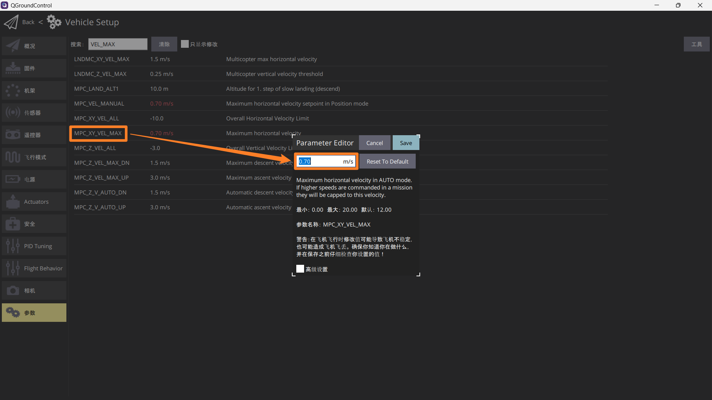

# QGroundControl

## 安装

请参考官网教程，在**个人PC**上安装该软件

https://docs.qgroundcontrol.com/master/en/qgc-user-guide/getting_started/download_and_install.html

## 通讯连接

1. 点击左上角QGC图标，点击`Application Settings`



3. 点击左侧列表`通讯连接`
4. 点击下方`添加`
5. 在`Name`中输入`Phoenixtech`（为飞机起个名字）
6. 将`Type`设置为`UDP`
7. 点击`确定`



## 连接飞控

::: tip

只有在无线连接时需要进行以下操作，如果是用USB直接从飞控连接电脑，就不需要

:::

1. 在机载电脑上执行以下指令，开启`MAVROS`以便连接飞控

```sh
roslaunch mavros px4.launch
```

2. 点击QGC左上角图标，点击`Application Settings`


3. 点击左侧列表`通讯连接`，点击`Phoenixtech`，点击`连接`



## 参数设置

点击左上角QGC图标，选择`Vehicle Setup`，在左侧列表找到`参数`

::: warning

每次修改完参数，记得在右上角`工具`中，选择重启飞行器，保存修改结果。

如果是无线连接，每次重启后，需在机载电脑上重新执行`roslaunch mavros px4.launch`

:::

### 定位相关

https://www.yuque.com/easonhua/nx9k7f/uurp9rbtdla8no6w

修改以下2个参数：

- EKF2_EV_CTRL

设置为由`/mavros/vision_pose/pose`提供定位信息



- EKF2_HGT_REF

改用视觉定高



- EKF2_GPS_CTRL

禁用GPS定位



- EKF2_BARO_CTRL

禁用气压计定高



### 速度限制

修改以下2个参数：

- MPC_XY_VEL_MAX

限制**水平方向速度**在0.7m/s以内



- MPC_Z_VEL_MAX

可以就按默认的参数来
