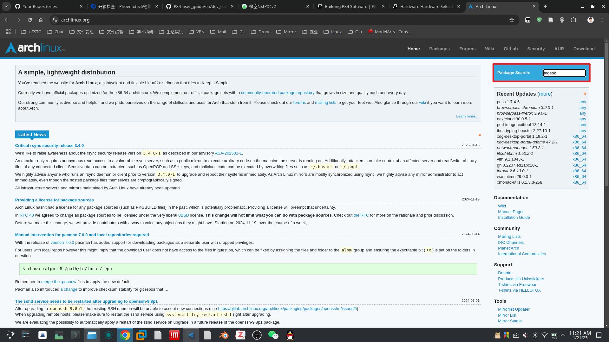
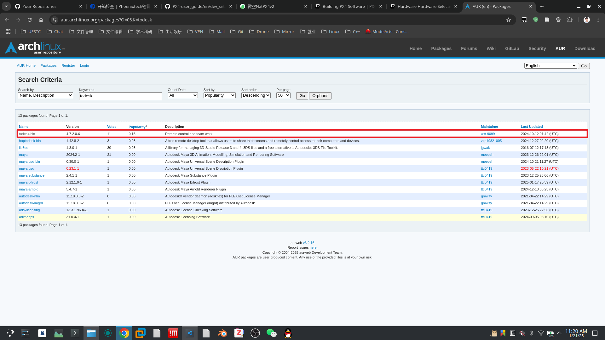
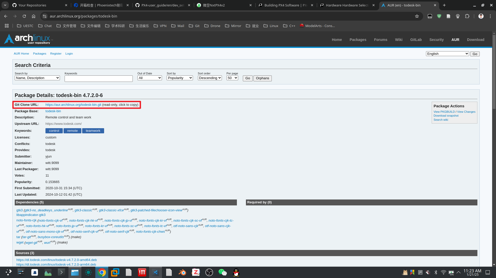
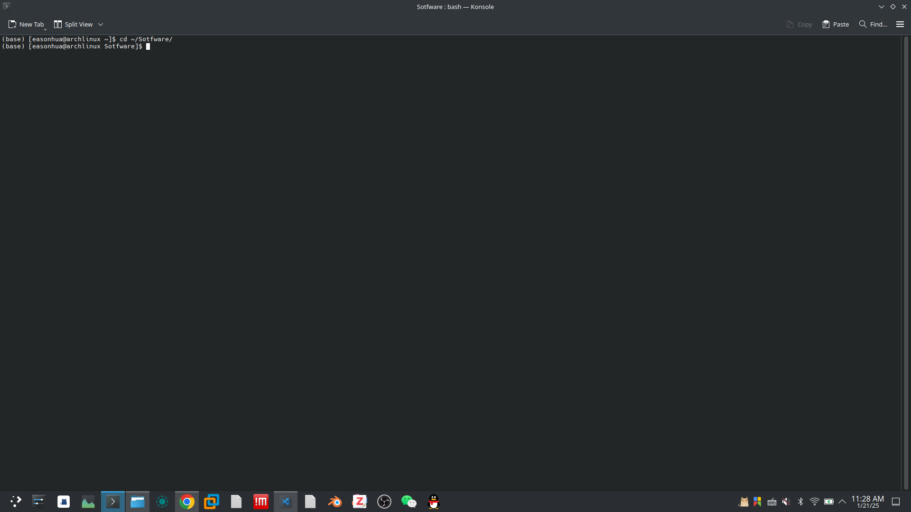
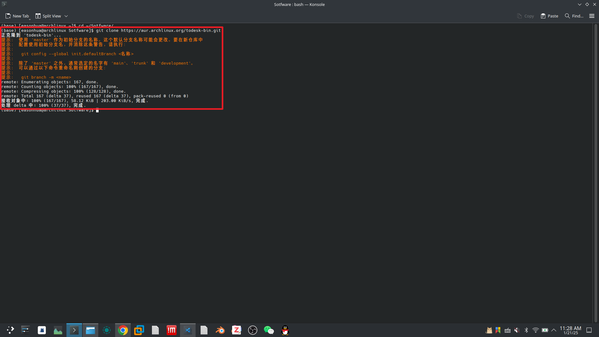
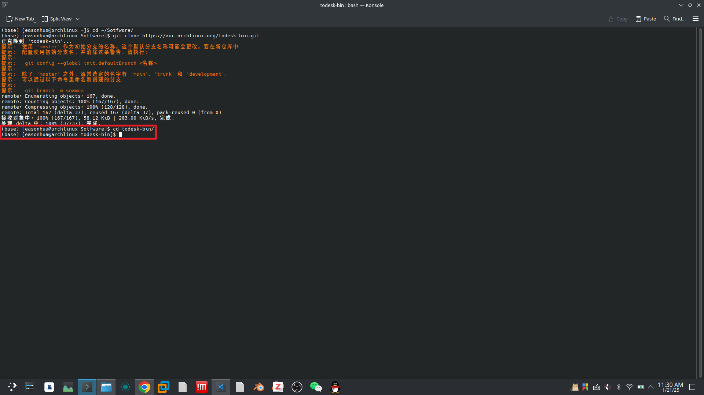
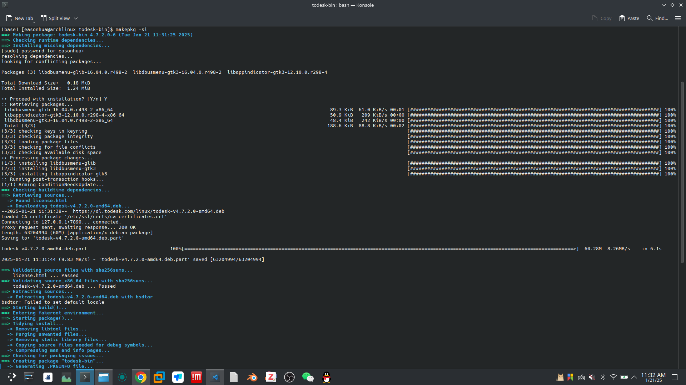
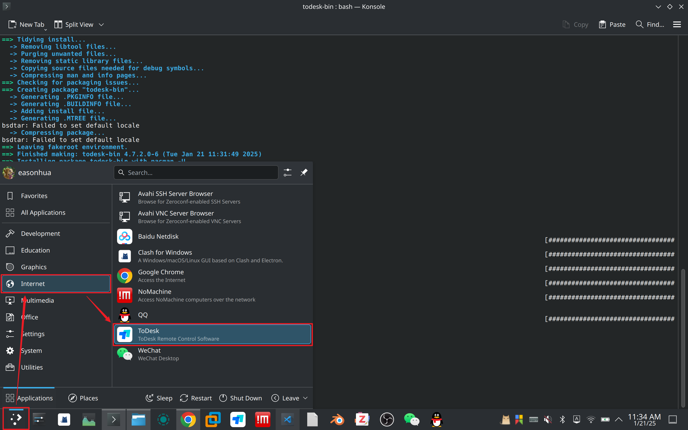
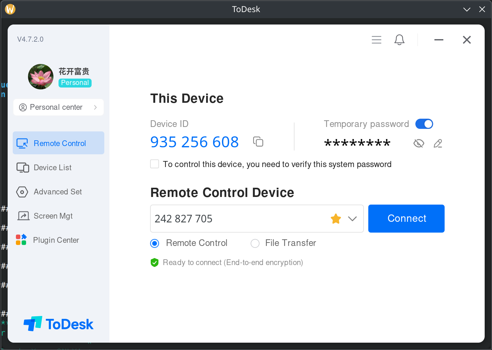

# ToDesk

ToDesk官网：https://www.todesk.com/

:::: tabs

::: tab Ubuntu

```sh
sudo snap install todesk
```

:::

::: tab Arch Linux

## 安装

danger

请勿根据`ToDesk`官网的安装教程进行安装，否则一定会遇到版本过低无法使用的错误！

打开浏览器，访问 https://aur.archlinux.org/

在右上角`Package Search`输入框输入`todesk`，回车进行搜索



在搜索结果列表中，找到`todesk-bin`，单击进入



找到`Git Clone URL`，单击复制



打开`Konsole`，导航到目标下载路径

```sh
cd ~/Sotfware/
```



执行以下指令，下载`todesk`源码

```sh
git clone https://aur.archlinux.org/todesk-bin.git
```



导航到`todesk-bin`文件夹

```sh
cd todesk-bin/
```



执行以下指令，编译并安装`todesk-bin`

```sh
makepkg -si
```

## 启动



在桌面左下角找到`Application Launcher`，在列表中找到`ToDesk`，单击图标启动





tip

如果在登陆账户时，不能正常连接网络，请执行以下命令初始化

```sh
sudo systemctl stop todeskd.service
sudo mv /opt/todesk/config/todeskd.conf /opt/todesk/config/todeskd.conf.bak
sudo systemctl start todeskd.service
```


## 卸载

```sh
sudo pacman -Rns todesk-bin
```

::::