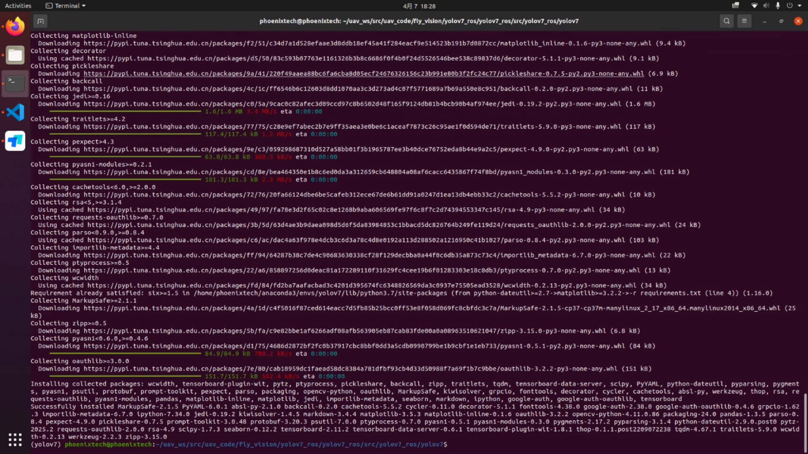
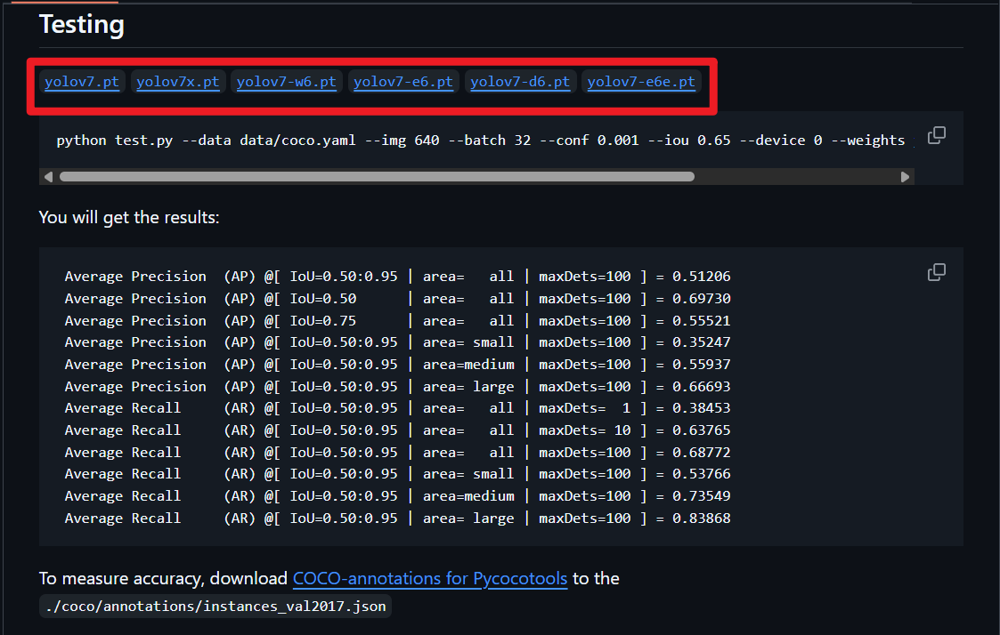
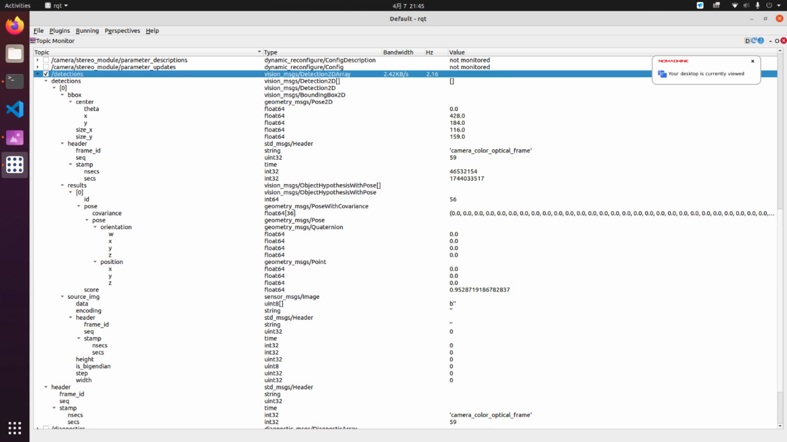

# YOLOv7使用教程

## 创建 conda 环境

翎霄科技出品的无人机在出厂时已经预装好了Anaconda环境，如果你还没有安装好 Anaconda，请先根据[官网教程](https://www.anaconda.com/docs/getting-started/anaconda/install#macos-linux-installation)把它装上

```bash
roscd yolov7_ros/src/yolov7_ros/yolov7
conda create -n yolov7 python=3.7.13
conda activate yolov7
```

::: danger
 
conda 环境只在训练和测试 YOLO 时会用到，其他时候必须关掉，否则可能无法正常启动 ROS 节点！

有两种方式可以关掉： 

1. 暂时关闭：直接在终端执行 `conda deactivate` 
2. 永久关闭：在 `~/.bashrc` 文件中注释掉与 conda 相关的内容

:::

## 安装一些 Python 库

#### 安装 PyTorch 库

访问[PyTorch官方网站](https://pytorch.org/get-started/locally/)，根据自身需求安装合适的版本。

例如：对于非 NVIDIA 显卡用户，执行以下指令：

```bash
conda install pytorch==1.13.1 torchvision==0.14.1 torchaudio==0.13.1 cpuonly -c pytorch
```

#### 安装其他库

```bash
pip install wandb
pip install -r requirements.txt
```



---

:::: tabs

::: tab 用官方提供的预训练模型

访问[YOLOv7官方网站](https://github.com/WongKinYiu/yolov7?tab=readme-ov-file#testing)，选择所需要的模型版本



下载预训练模型（默认是yolov7.pt）到`~/uav_ws/src/uav_code/yolov7_ros/yolov7_ros/weights/`文件夹下

```bash
roscd yolov7_ros/weights/
wget https://github.com/Phoenixtuav/Phoenixtuav.github.io/releases/download/v0.0.1/yolov7.pt
```

:::

::: tab 自己准备数据集自己训练模型

## 准备数据集

::: warning

我们建议在RoboFlow平台统一管理我们的数据

这个平台需要挂梯子才能登入

:::

1. 访问[官方网站](https://app.roboflow.com/easonhua/phoenixtech/1)

以上是我个人准备的数据集，如果你已经准备好了自己的数据集，请直接跳过这一步

2. 点击右上角`Download Dataset`
3. 选择`Download Dataset`
4. 点击`Continue`

.png)

5. 将`Format`选为`YOLO v7 PyTorch`
6. 将`Download Options`选为`Download zip to computer`
7. 点击`Continue`

.png)

8. 将.zip 压缩包保存在`~/uav_ws/src/uav_code/fly_vision/yolov7_ros/yolov7_ros/src/yolov7_ros/yolov7/data/`文件夹下

::: info

如果您暂时无法登入该网站，可以通过以下方式下载

```bash
roscd yolov7_ros/src/yolov7_ros/yolov7/data/
wget https://github.com/Phoenixtuav/Phoenixtuav.github.io/releases/download/v0.0.1/Phoenixtech.v1i.yolov7pytorch.zip
```

:::

9. 解压缩该压缩包

```bash
roscd yolov7_ros/src/yolov7_ros/yolov7/data/
unzip Phoenixtech.v1i.yolov7pytorch.zip
```

10. 找到`data.yaml`，将前 3 行中的路径替换为绝对路径

.png)

---

## 模型训练

1. 访问[YOLOv7官方网址](https://github.com/WongKinYiu/yolov7?tab=readme-ov-file#transfer-learning)，选择所需要的预训练模型

.png)

把文件下载到`~/uav_ws/src/uav_code/yolov7_ros/yolov7_ros/weights/`文件夹下

```bash
roscd yolov7_ros/weights/
wget https://github.com/Phoenixtuav/Phoenixtuav.github.io/releases/download/v0.0.1/yolov7_training.pt
```

2. 找到 `cfg/training` 文件夹下，选择你想要训练的模型版本，然后在该文件夹下复制一份，重命名一下，例如 `yolov7-phoenixtech.yaml`
3. 将`yolov7-phoenixtech.yaml`中的参数 `nc` 修改为数据集中实际样本种类

.png)

3. 执行以下指令开始迁移学习

```bash
roscd yolov7_ros/src/yolov7_ros/yolov7/
python3 train.py --data data/data.yaml --batch-size 1 --cfg cfg/training/yolov7-phoenixtech.yaml --weights ../../../weights/yolov7_training.pt --name yolov7-phoenixtech --hyp data/hyp.scratch.custom.yaml --device cpu
```

参数设置（注意是相对路径）

| data | 数据集附带 | data.yaml |
| --- | --- | --- |
| batch-size | 每轮训练调用的数据量 | 电脑性能可以设置得更多 |
| cfg | 模型结构文件 | |
| weights | 预训练模型 | 和 cfg 中的对应上 |
| name | 新模型名字 | |
| hyp | 模型超参文件 | 按默认就行 |
| device | 训练时用的设备 | 有 NVIDIA 显卡就选 cuda，否则选 cpu |

出现以下结果说明已经开始训练了

.png)

::: info

您在使用YOLO时可能会遇到一些报错，请参考[这篇文档](../8.报错处理/8-1%20YOLOv7训练报错.md)解决。

:::

4. 每次训练结果在`runs`文件夹下

:::

::::

---

## 开始实验

打开深度相机：

```bash
roslaunch realsense2_camera rs_camera.launch
```

找到`fly_demo`包下的`yolov7_ros.launch`文件

```xml
<?xml version="1.0" encoding="UTF-8"?>
<launch>
  <arg name="weights" default="$(find yolov7_ros)/weights/yolov7.pt" />
  <arg name="image_size" default="640" />
  <arg name="confidence_threshold" default="0.75" />
  <arg name="iou_threshold" default="0.45" />
  <arg name="device" default="cpu" />

  <node name="yolov7" pkg="yolov7_ros" type="detect.py" output="screen">
    <param name="weights" value="$(arg weights)" />
    <param name="image_size" value="$(arg image_size)" />
    <param name="confidence_threshold" value="$(arg confidence_threshold)" />
    <param name="iou_threshold" value="$(arg iou_threshold)" />
    <param name="device" value="$(arg device)" />
    <remap from="/image_raw"  to="/camera/color/image_raw" />
  </node>

  <node pkg="rqt_image_view" type="rqt_image_view" name="rqt_image_view" args="/image_dets"/>
</launch>
```

| weights | 模型文件路径 | |
| --- | --- | --- |
| confidence_threshold | 置信度，高于该值的检测结果才会被输出 | |
| device | 测试时调用的设备 | 有 NVIDIA 显卡就选 cuda，否则选 cpu |
| /image_raw | 输入给模型的图片话题 | 默认是/camera/color/image_raw |
| /image_dets | 检测结果输出话题 | |

新开一个终端，启动 YOLOv7 节点：

```bash
roslaunch fly_demo yolov7_ros.launch
```

---

## 检测结果

图片结果输出在`/image_dets`话题下

.png)

::: info

以下部分强烈建议点开链接，查看原始数据，增加理解！

:::

具体结果输出在`/detections`话题下，格式为[vision_msgs/Detection2DArray](https://docs.ros.org/en/noetic/api/vision_msgs/html/msg/Detection2DArray.html)

可以用`rqt`中的`Topic Monitor`来查看话题内容：



每一个框就是`detections[]`数组中的一个元素，这个元素的格式为[vision_msgs/Detection2D](https://docs.ros.org/en/noetic/api/vision_msgs/html/msg/Detection2D.html)

这个元素由以下几部分组成：

+ [vision_msgs/ObjectHypothesisWithPose](https://docs.ros.org/en/noetic/api/vision_msgs/html/msg/ObjectHypothesisWithPose.html)格式的`results[]`数组（一般只有 1 个元素）
    - 其中的每个元素包括 `id`（类别）、`score`（置信度）、`pose`（位姿）
+ [vision_msgs/BoundingBox2D](https://docs.ros.org/en/noetic/api/vision_msgs/html/msg/BoundingBox2D.html)格式的 `bbox`
    - 其中包括 `center`（物体中心的像素坐标，坐标系如上图黄色箭头表示）、`size_x`、`size_y`

以下是一则简单的回调函数的例子：

```cpp
void FSM::yoloCallback(const vision_msgs::Detection2DArray::ConstPtr &msg) {
    // 遍历所有检测到的目标
    for (size_t cnt_ = 0; cnt_ < msg->detections.size(); cnt_++) {
        // 获取当前检测的目标框
        vision_msgs::Detection2D detection = msg->detections[cnt_];
        vision_msgs::ObjectHypothesisWithPose result = detection.results[0];

        cout << "------------------ YOLO ------------------" << endl;

        // 确保类别是 landing_pad
        if (result.id == 4) {
            // 计算目标框的中心坐标（像素坐标）
            Eigen::Vector2d center_pixel_pad_(detection.bbox.center.x, detection.bbox.center.y);

            // 初始化数据
            centerErrorPad_ << center_pixel_pad_(0) - cx, center_pixel_pad_(1) - cy;

            cout << "centerErrorPad: " << centerErrorPad_.transpose() << endl;
        }
        else {
            cout << "NOT a landing_pad!" << endl;
        }
    }
}
```
