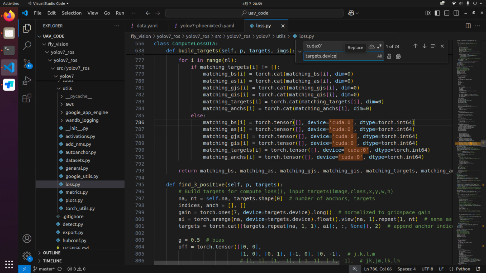
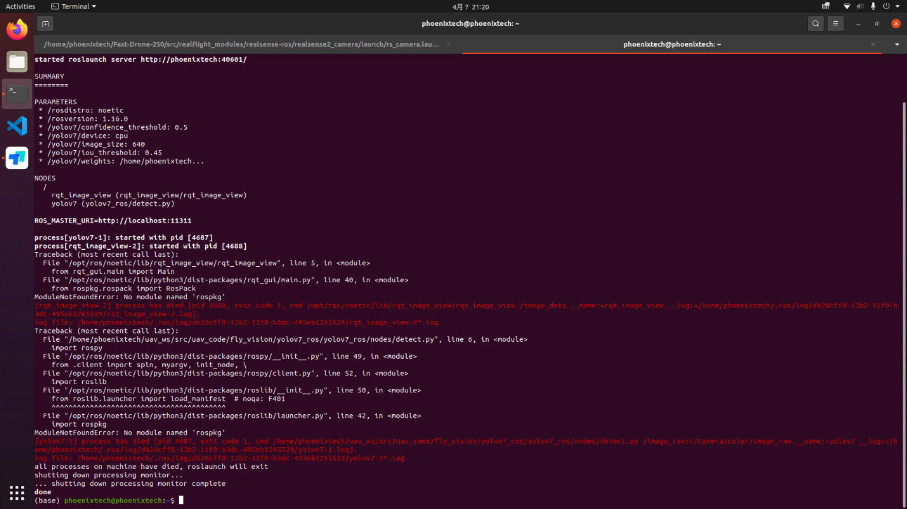

# YOLOv7报错

## AssertionError: Torch not compiled with CUDA enabled

### 错误原因

电脑没有 NVIDIA 显卡

### 解决方案

找到`utils/loss.py`，将文件中所有 24 处`'cuda:0'`替换为`targets.device`



---

## Exception: Dataset not found

.png)

### 错误原因

数据集路径不匹配

### 解决方案

找到`data/data.yaml`，将前 3 行中的路径替换为绝对路径

.png)

---

## Killed

.png)

### 错误原因

内存爆了

### 解决方案

把 `batch-size`设置得小一点

## ModuleNotFoundError: No module named 'rospkg'



### 错误原因

在conda中运行ROS节点

### 解决方案

退出conda环境

```bash
conda deactivate
```
